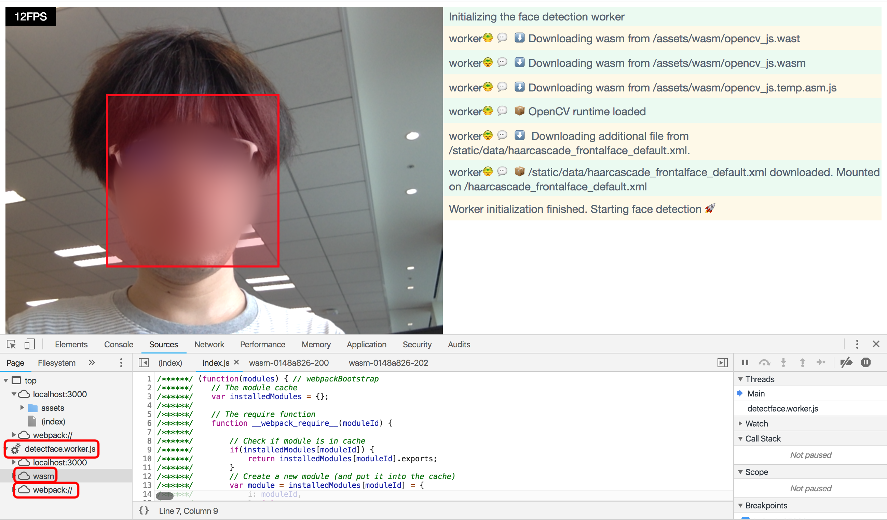

opencvjs-wasm-webworker-webpack-demo
====================================

A demo of in-browser face detection, using
[OpenCV.js](https://docs.opencv.org/3.4.2/d4/da1/tutorial_js_setup.html)
built as [WebAssembly (WASM)](https://webassembly.org/), running through
[Web Worker](https://developer.mozilla.org/docs/Web/API/Web_Workers_API) and
bundled by [webpack](https://webpack.js.org/).

Hopefully to be a good scaffold to start any OpenCV.js projects.



Live Demo
---------

**https://mecab.github.io/opencvjs-facedetect-livedemo**


How to run
----------

```bash
$ npm install
$ npm run debug
```

(Debug/development purpose. Your modification will show up soon by
`webpack --watch` and `node-dev`)

or

```bash
$ npm install
$ npm run build
$ npm start
```

(Production purpose. Produces minified JS, however you will need to
build the assets to reflect your edit.)

Where `opencv.js`, `opencv_js.js` and `opencv_js.wasm` come from
------------------------------------------------------------------
These compiled js and wasm files are built from [OpenCV v3.4.2](https://docs.opencv.org/3.4.2/index.html) source through [OpenCV.js offical build instruction](https://docs.opencv.org/3.4.2/d4/da1/tutorial_js_setup.html).

I pushed a [Docker image](https://hub.docker.com/r/mecab/opencv-wasm-builder/) to generate them so that you can easily build them by yourself. [Dockerfile](https://github.com/mecab/docker-opencv-wasm-builder) is also available.

LICENSE
-------
This is available as open source under the terms of the [MIT License](http://opensource.org/licenses/MIT).
